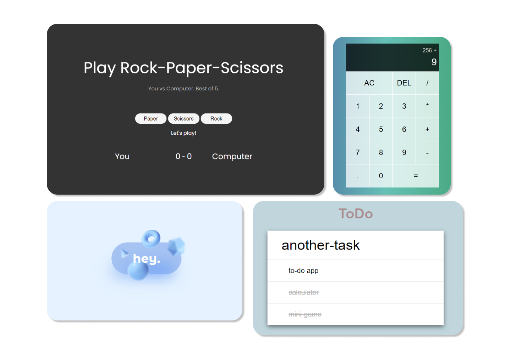

# :hammer_and_wrench: Mini-Projects

## Projects that helped me learn HTML, CSS and JS.

### Demos:

 [:pencil2:Auto-Writer](https://serh1.github.io/mini-projects/2-auto-write) -
 [:heavy_division_sign:Calculator](https://serh1.github.io/mini-projects/3-calculator) -
 [:hamburger:Hamburger](https://serh1.github.io/mini-projects/4-hamburger) 
  
 [:arrow_forward:Button](https://serh1.github.io/mini-projects/5-magic-button) -
 [:rock:Rock-Paper-Scissors](https://serh1.github.io/mini-projects/6-rock-paper-scissors) -
 [:white_check_mark:ToDo App](https://serh1.github.io/mini-projects/7-todo-app) 

Demo also available at: 'https://serh1.github.io/mini-projects/ + 'number-project_name'

